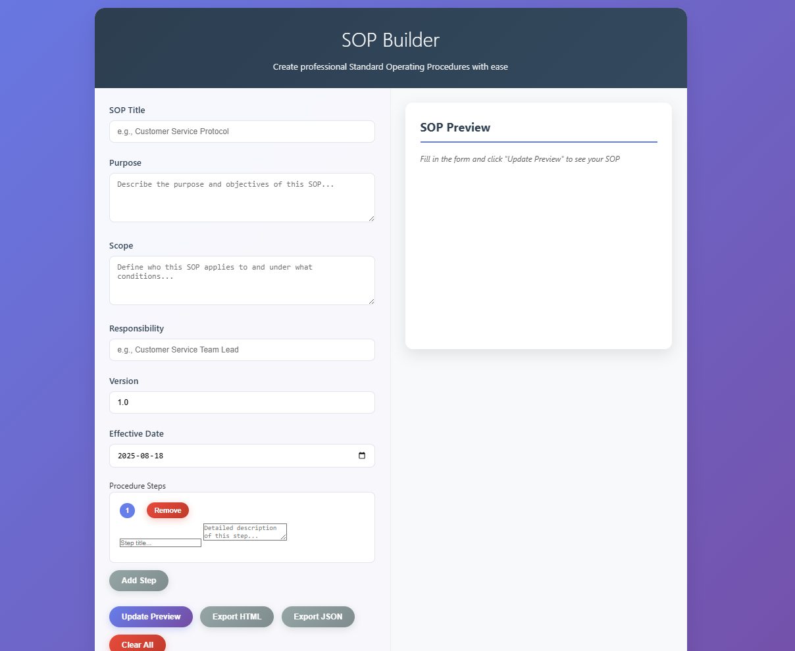

# SOP Designer

A lightweight, browser-based tool for building **Standard Operating Procedures (SOPs)** with live preview and export options. No installation—just open and go.

---

##  Features
- **Live Preview** — See your SOP formatted instantly  
- **Export Options** — Save as **HTML** for sharing or **JSON** for backup/editing  
- **Dynamic Steps** — Add, edit, or remove procedures on the fly  
- **Mobile-Friendly** — Works on phones, tablets, and desktop browsers  
- **Zero Dependencies** — Just one `index.html` file—no setup, no install

---

##  Getting Started
1. Clone the repo or download `index.html`  
2. Open it in any modern browser  
3. Fill out the form and add your procedure steps  
4. Click **Update Preview** to see the formatted SOP  
5. Export as **HTML** or **JSON**

---

##  GitHub Pages Hosting
Host the tool live via GitHub Pages:
1. Fork this repo  
2. Go to **Settings → Pages**  
3. Select **Branch: main** and **/ (root)**  
4. Visit your live site at:  
   `https://dgsconsulting.github.io/SOP-Designer/`

---

##  Example SOP Structure
An SOP created with this tool typically contains:
- Title, version, and dates  
- Purpose and scope  
- Numbered steps  
- Clean, professional styling

---

##  File Structure
SOP-Designer/

├── index.html # The tool

├── README.md # This documentation

├── LICENSE # MIT License

└── assets/

└── screenshot.png # Example screenshot

---

##  Contributing
Got ideas or fixes? Please contribute:
- Report issues or feature requests [here](../../issues)  
- Submit a pull request to help improve the tool

---

##  License
Distributed under the [MIT License](LICENSE)—free for personal or commercial use.
