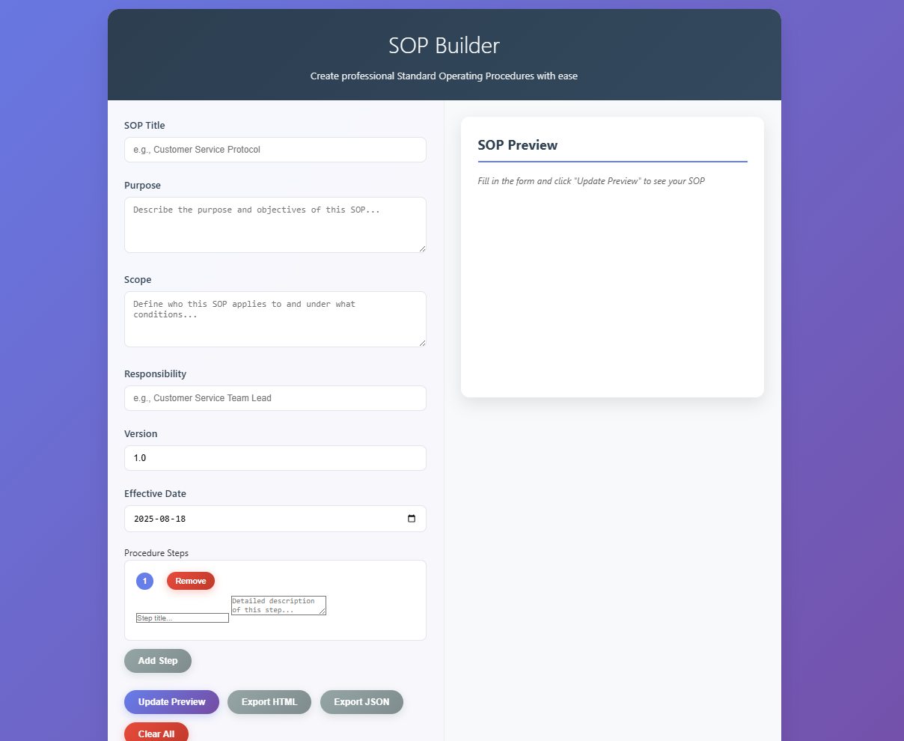

---

# SOP Designer

A lightweight, browser-based tool for creating **Standard Operating Procedures (SOPs)** with live preview and export options.
No installation required—just open and start building.



---

## ✨ Features

* **Live Preview** – See your SOP formatted in real-time
* **Export Options** – Download as **HTML** (for sharing) or **JSON** (for backup/editing)
* **Dynamic Steps** – Add, edit, or remove procedure steps on the fly
* **Mobile Friendly** – Works on phones, tablets, and desktops
* **Zero Dependencies** – A single `index.html` file, no setup required

---

## 🚀 Getting Started

1. **Download** this repository or just `index.html`
2. Open `index.html` in any modern browser
3. Fill in the form fields and add procedure steps
4. Click **Update Preview** to see your formatted SOP
5. Export as **HTML** (shareable) or **JSON** (editable)

---

## 🌐 GitHub Pages Hosting

You can host this tool directly with GitHub Pages:

1. Fork this repository
2. Go to **Settings → Pages**
3. Set **Branch: main** and **/ (root)**
4. Access your live version at:
   `https://dgsconsulting.github.io/SOP-Designer/`

---

## 📄 Example SOP Structure

A standard SOP created with this tool includes:

* Title, version, and dates
* Purpose and scope
* Numbered procedure steps
* Clean, professional formatting

---

## 📂 File Structure

```
SOP-Designer/
├── index.html    # Complete application
├── README.md     # Documentation
└── LICENSE       # MIT License
```

---

## 🤝 Contributing

Contributions are welcome!

* Open an [issue](../../issues) for bug reports or feature requests
* Submit a pull request if you’d like to improve the tool

---

## 📜 License

This project is licensed under the [MIT License](LICENSE).
Free for personal or commercial use.

---

